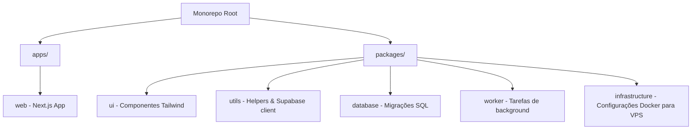

# 📅 Agenda Inteligente — SaaS Web Multi-Tenant

> Sistema SaaS completo de agendamento e gestão para clínicas e consultórios médicos/odontológicos, com isolamento multi-tenant, integração de pagamentos recorrentes (Asaas) e envio automatizado de mensagens via WhatsApp (Evolution API).

---

## 🚀 Sobre o Projeto

O **Agenda Inteligente** é um software de gestão sob demanda (SaaS) robusto e responsivo desenvolvido para atender consultórios e clínicas em todo o Brasil. Seguindo as definições oficiais em [docs/MASTER_PROJECT_CONTEXT.md](file:///c:/Users/USER/Desktop/JAMILY%20PAGINA/Projetoapp/Agenda-Inteligente.app-1/docs/MASTER_PROJECT_CONTEXT.md), o projeto **não possui aplicativos mobile nativos** (Android/iOS) e é focado exclusivamente em ser um **SaaS Web responsivo**, funcionando perfeitamente em Desktop, Tablet e Navegadores Mobile.

---

## 🛠️ Tecnologias Utilizadas (Tech Stack)

| Camada             | Tecnologia                                                | Descrição                                              |
| :----------------- | :-------------------------------------------------------- | :----------------------------------------------------- |
| **Frontend**       | [Next.js 14/15+](https://nextjs.org/)                     | App Router, Server Components, SSR & API Routes        |
| **Linguagem**      | [TypeScript](https://www.typescriptlang.org/)             | Tipagem estática segura em todo o monorepo             |
| **Estilização**    | [Tailwind CSS](https://tailwindcss.com/) / UI Customizada | Estilização ágil e responsiva Mobile-First             |
| **Banco de Dados** | [Supabase](https://supabase.com/) / PostgreSQL            | Armazenamento relacional com isolamento multi-tenant   |
| **Mensageria**     | [Evolution API](https://evolution-api.com/) & Redis       | Engine de WhatsApp hospedada em VPS Hostinger dedicada |
| **Assinaturas**    | [Asaas](https://www.asaas.com/)                           | Gateway de pagamentos para cobranças recorrentes       |
| **Monorepo**       | [Turborepo](https://turbo.build/)                         | Gerenciamento de workspaces e build otimizado          |
| **CI/CD**          | [GitHub Actions](https://github.com/features/actions)     | Pipeline automatizado de linting, build e testes       |

---

## 🏗️ Estrutura do Projeto (Monorepo)

O projeto está organizado como um monorepo gerenciado por workspaces no [package.json](file:///c:/Users/USER/Desktop/JAMILY%20PAGINA/Projetoapp/Agenda-Inteligente.app-1/package.json):



- **[apps/web](file:///c:/Users/USER/Desktop/JAMILY%20PAGINA/Projetoapp/Agenda-Inteligente.app-1/apps/web/package.json):** Aplicação Next.js principal (Dashboard, Landing, Fluxos de Onboarding e API routes).
- **[packages/ui](file:///c:/Users/USER/Desktop/JAMILY%20PAGINA/Projetoapp/Agenda-Inteligente.app-1/packages/ui/package.json):** Biblioteca compartilhada de componentes de interface.
- **[packages/utils](file:///c:/Users/USER/Desktop/JAMILY%20PAGINA/Projetoapp/Agenda-Inteligente.app-1/packages/utils/package.json):** Helpers utilitários e conexões compartilhadas do SDK.
- **[packages/worker](file:///c:/Users/USER/Desktop/JAMILY%20PAGINA/Projetoapp/Agenda-Inteligente.app-1/packages/worker/package.json):** Lógica e serviços de background em execução contínua.
- **[docs/](file:///c:/Users/USER/Desktop/JAMILY%20PAGINA/Projetoapp/Agenda-Inteligente.app-1/docs):** Contém os manuais e regras detalhadas do sistema.

---

## 📋 Principais Módulos do Sistema

O sistema conta com as seguintes áreas funcionais descritas nas Regras de Negócio ([docs/BUSINESS_RULES.md](file:///c:/Users/USER/Desktop/JAMILY%20PAGINA/Projetoapp/Agenda-Inteligente.app-1/docs/BUSINESS_RULES.md)):

- **Dashboard:** Painel principal com métricas financeiras de faturamento e agendamentos futuros.
- **Agenda Inteligente:** Calendário interativo para agendamentos rápidos de consultas e procedimentos.
- **Gestão de Clientes:** Cadastro detalhado de pacientes, histórico médico, anamnese e avaliações físicas.
- **Gestão Financeira:** Controle de fluxo de caixa da clínica, despesas e faturamento.
- **Estoque & Suprimentos:** Controle de produtos e insumos médicos utilizados.
- **Funcionários & Assentos:** Controle de cotas e usuários cadastrados com base no plano contratado da clínica.
- **Notificações & WhatsApp:** Integração automática via Evolution API para envio de lembretes e avisos aos clientes.

---

## 🔐 Níveis de Acesso e Permissões

- **Administrador (Dono):** Acesso global à clínica e controle de faturamento e assinatura.
- **Chefe:** Nível tático com acesso amplo ao sistema, exceto gerenciar a assinatura financeira no Asaas.
- **Profissional / Dentista / Médico:** Acesso exclusivo às suas próprias consultas e prontuários de pacientes, sem visualização financeira da clínica.
- **Financeiro:** Acesso exclusivo a relatórios, contas a pagar/receber e assinatura.
- **Recepção:** Acesso à agenda e marcações gerais para todos os profissionais.

---

## ⚙️ Configuração Local e Execução

### Pré-requisitos

- Node.js `20.x` ou superior
- NPM `10.2.4` ou superior

### Passos para Configuração

1. **Clone o repositório:**

   ```bash
   git clone <URL_DO_SEU_REPOSITORIO>
   cd Agenda-Inteligente.app-1
   ```

2. **Configure as Variáveis de Ambiente:**
   Use o arquivo [.env.example](file:///c:/Users/USER/Desktop/JAMILY%20PAGINA/Projetoapp/Agenda-Inteligente.app-1/.env.example) como base e preencha as variáveis de ambiente necessárias na raiz do monorepo:

   ```bash
   cp .env.example .env
   ```

3. **Instale as dependências:**

   ```bash
   npm install
   ```

4. **Inicie o servidor de desenvolvimento local:**
   ```bash
   npm run dev
   ```
   Isso iniciará o Turborepo em modo de desenvolvimento paralelo. O frontend Next.js estará acessível por padrão em `http://localhost:3000`.

---

## 🧪 Rodando Testes e Validações

O projeto utiliza **Vitest** para testes unitários e de integração, além de **Prettier** e **ESLint** para formatação e análise estática:

- **Executar todos os testes:**
  ```bash
  npx turbo run test
  ```
- **Executar Lint:**
  ```bash
  npm run lint
  ```
- **Executar Formatação:**
  ```bash
  npm run format
  ```

---

## 🛠️ Deploy & Integração Contínua (CI/CD)

Conforme descrito no [docs/DEPLOY.md](file:///c:/Users/USER/Desktop/JAMILY%20PAGINA/Projetoapp/Agenda-Inteligente.app-1/docs/DEPLOY.md), o fluxo de deploy é automatizado:

1. **GitHub Actions:** O pipeline em [.github/workflows/ci.yml](file:///c:/Users/USER/Desktop/JAMILY%20PAGINA/Projetoapp/Agenda-Inteligente.app-1/.github/workflows/ci.yml) executa o linting, testes unitários e validação de build estático do Next.js a cada Push ou Pull Request na branch `main`.
2. **Frontend & API Routes (Vercel):** Hospedado na Vercel com deploy contínuo integrado à branch `main`.
3. **WhatsApp Evolution API (Hostinger VPS):** Provisionado e implantado por Docker Compose via SSH na VPS da Hostinger.
